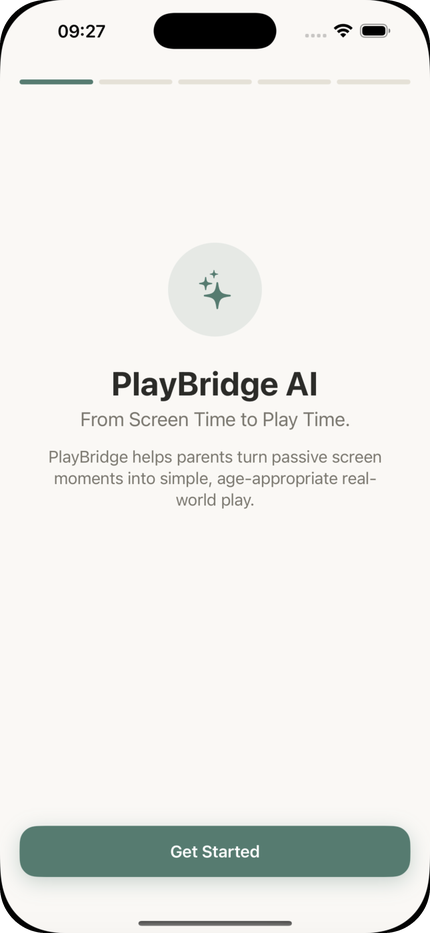
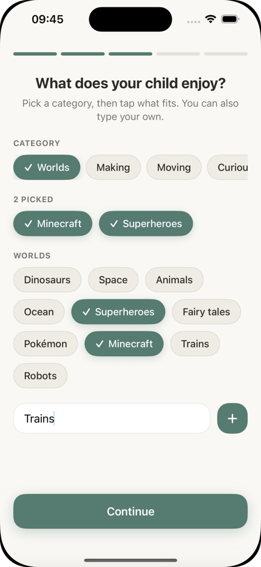
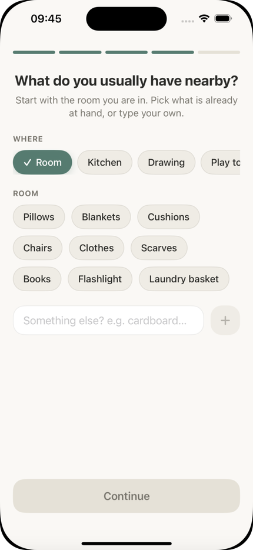
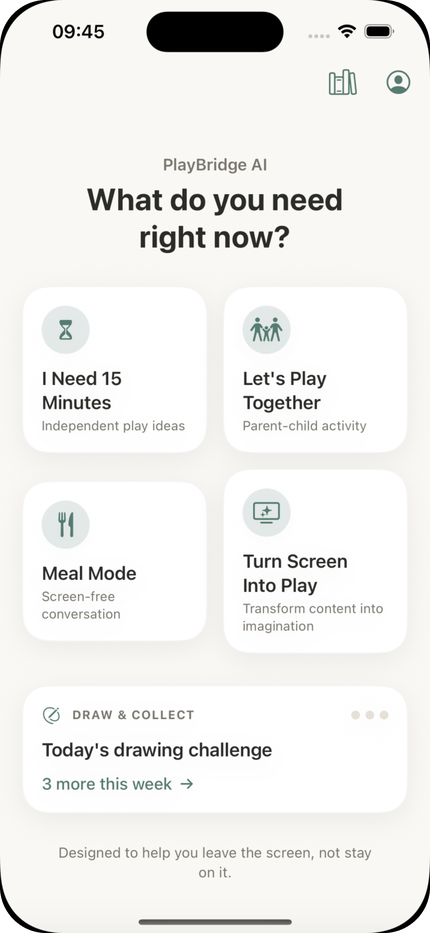
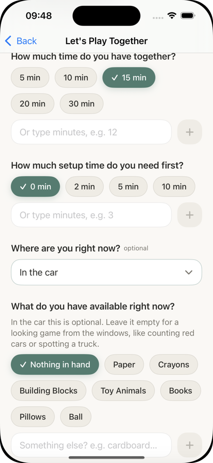
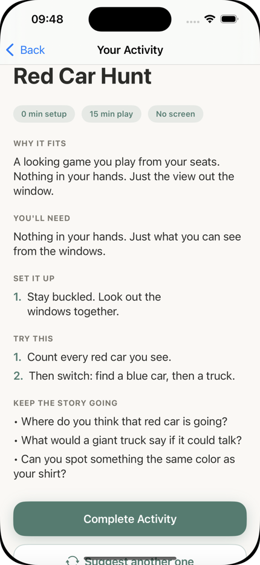
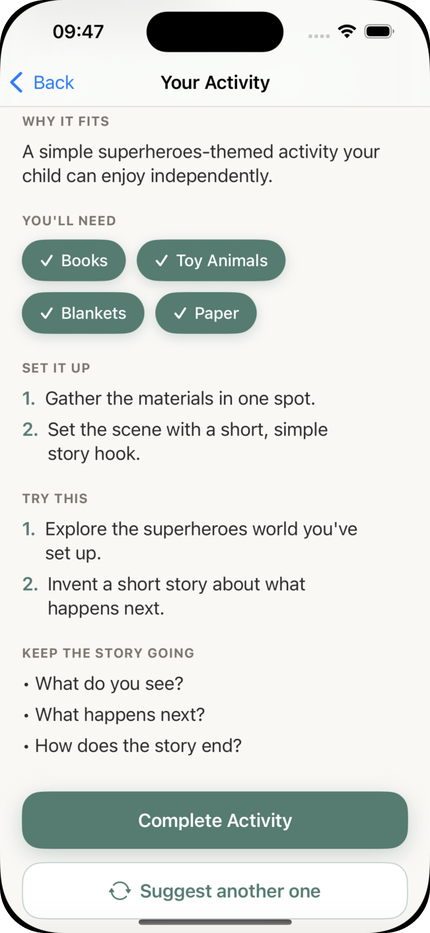
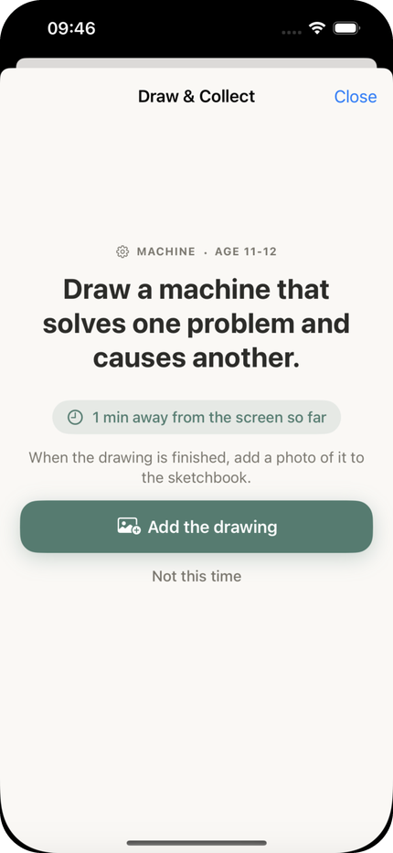
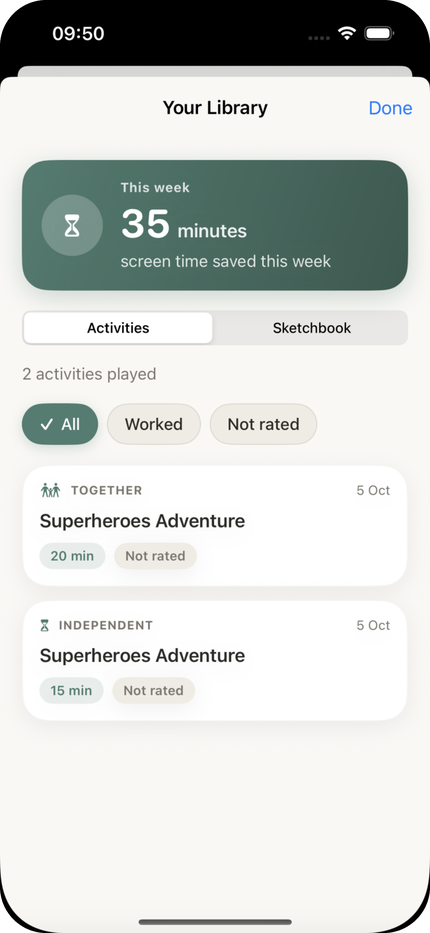

# PlayBridge AI

Ekran süresini azaltmak için ebeveyne ekrana alternatif bir platform sunan iOS uygulaması. Çocuğun yaşına, ilgi alanlarına, evdeki malzemelere ve bulunduğu mekana göre saniyeler içinde güvenli bir oyun fikri üretiyor.

Samsung Innovation Campus Hackathon 2026, ekran bağımlılığı teması.

[Demo videosunu izle](https://www.youtube.com/watch?v=BcjpoSNYbRY)

---

## Yarışma ve proje odağı

Bu proje, Samsung Innovation Campus programı kapsamında UNDP ve Yeşilay iş birliğiyle düzenlenen ekran bağımlılığı hackathonu için geliştirildi. Yarışmanın ana odağı ekran bağımlılığı.

Bizim seçtiğimiz açı, çocuklarda ekran süresini azaltmak ve bunu yasaklayarak ya da süre sınırı koyarak değil, ekranın yerine geçecek alternatif bir platform sunarak yapmak. Ebeveynin en çok zorlandığı an, ekranı kapattıktan sonra çocuğun "şimdi ne yapacağım" demesi. O anda ebeveynin elinde hazır, çocuğa uygun ve güvenli bir fikir yoksa ekran geri açılıyor. PlayBridge AI bu boşluğu dolduruyor.

---


## PlayBridge AI ne işe yarar?

Ebeveyn çocuğun yaşını, ilgi alanlarını ve evde genelde elinin altında olan malzemeleri bir kez giriyor. Sonrasında ihtiyacı olan anda dört moddan birini seçip tek dokunuşla fikir alıyor:


| Mod                   | Ne zaman kullanılır                                                                   |
| --------------------- | ------------------------------------------------------------------------------------- |
| I Need 15 Minutes     | Ebeveynin işi var, çocuğun yalnız başına oynayabileceği bir fikir lazım               |
| Let's Play Together   | Ebeveyn ve çocuk birlikte vakit geçirecek                                             |
| Meal Mode             | Yemek sırasında ekransız bir sohbet başlatmak için tek cümlelik soru                  |
| Turn Screen Into Play | Çocuğun izlediği ya da oynadığı içerik, gerçek dünyada oynanacak bir oyuna çevriliyor |


Uygulamanın ölçtüğü tek şey ekrandan kurtarılan süre. Ebeveyn bir aktiviteyi tamamladığında süre haftalık toplama ekleniyor ve ana metrik olarak profilde ve kütüphanede gösteriliyor.

---


## Ekranlar


| Karşılama                       | İlgi Alanları                     | Malzemeler                        |
| ------------------------------- | --------------------------------- | --------------------------------- |
|  |  |  |


| Ana Ekran                    | Birlikte Oyna                          | Arabada Aktivite                        |
| ---------------------------- | -------------------------------------- | --------------------------------------- |
|  |  |  |


| Bağımsız Oyun Sonucu                       | Draw & Collect                       | Kütüphane                       |
| ------------------------------------------ | ------------------------------------ | ------------------------------- |
|  |  |  |


### Ekran ekran akış

**Karşılama ve onboarding.** İlk açılışta beş adımlı bir kurulum var (karşılama, yaş, ilgi alanı, malzeme, gizlilik). Üstteki ilerleme çubuğu kullanıcıya ne kadar kaldığını gösteriyor. Karşılama ekranı uygulamanın amacını tek cümlede söylüyor: "From Screen Time to Play Time".

**Yaş ve ilgi alanları.** Yaş dört aralıktan seçiliyor: 5-6, 7-8, 9-10, 11-12. İlgi alanları kategorilere ayrılmış (Worlds, Making, Moving, Curious ve diğerleri). Worlds altında Dinosaurs, Space, Animals, Ocean, Superheroes, Fairy tales, Pokémon, Minecraft, Trains ve Robots gibi seçenekler var, ayrıca ebeveyn kendi ilgi alanını yazıp ekleyebiliyor. Seçilenler ayrı bir "picked" satırında toplanıyor.

**Malzemeler.** Malzemeler bulunulan yere göre gruplanıyor (Room, Kitchen, Drawing, Play toys). Oda için yastık, battaniye, minder, sandalye, kıyafet, eşarp, kitap, el feneri ve çamaşır sepeti gibi gerçekten evde bulunan şeyler listeleniyor. Listede olmayan bir şey için serbest metin alanı var. Amaç, üretilen fikrin ebeveynden alışveriş ya da hazırlık istememesi.

**Ana ekran.** "What do you need right now?" sorusuyla dört mod kartı ve altında günün çizim görevini gösteren Draw & Collect kartı yer alıyor. Sağ üstte kütüphane ve profil ikonları var.

**Girdi ekranları.** Her modda ebeveyn kaç dakikası olduğunu (5, 10, 15, 20, 30 ya da elle girilen süre), kaç dakika hazırlık yapabileceğini (0, 2, 5, 10), nerede olduğunu ve elinde ne olduğunu seçiyor. Mekân alanı isteğe bağlı. Arabada "Nothing in hand" seçeneği var, bu durumda pencereden bakarak oynanan oyunlar öneriliyor.

**Aktivite sonucu.** Üretilen aktivite sabit bir yapıda geliyor: neden uygun (Why it fits), neye ihtiyaç var (You'll need), hazırlık (Set it up), oyun (Try this) ve hikâyeyi sürdürmek için sorular (Keep the story going). Başlığın altında hazırlık süresi, oyun süresi ve ekran gerektirmediğini gösteren etiketler var. "Complete Activity" oyunu kaydediyor, "Suggest another one" aynı girdiyle yeni bir fikir istiyor.

**Draw & Collect.** Çocuğa yaşına uygun günlük bir çizim görevi veriliyor (örnek: "Draw a machine that solves one problem and causes another", yaş 11-12). Ekranda görev sırasında ekrandan uzak geçen süre sayılıyor. Çizim bitince ebeveyn fotoğrafını sketchbook'a ekliyor.

**Kütüphane.** Üstte haftalık "screen time saved" süresi, altında oynanan aktiviteler (Together ya da Independent etiketiyle) ve Sketchbook sekmesi var. Aktiviteler "All", "Worked" ve "Not rated" filtreleriyle listeleniyor.

---


## Özellikler

- Dört farklı mod: bağımsız oyun, birlikte oyun, yemek sohbeti, ekranı oyuna çevirme
- Yaşa göre ölçekleme: 5 ile 12 yaş arası dört aralık, üretim promptları yaşa göre sadeleşiyor ya da zorlaşıyor
- Ev malzemelerine ve mekana göre üretim: oturma odası, mutfak, araba, dış mekân. Arabada küçük parçalı ya da yer isteyen oyun önerilmiyor, kemer takılıyken yapılabilen oyunlar üretiliyor. Mutfakta ocak, sıcak yüzey ve bıçaktan uzak fikirler seçiliyor
- İki aşamalı çocuk güvenliği: her aktivite üretildikten sonra ayrı bir yapay zeka çağrısıyla inceleniyor
- Hata ekranı yok: yapay zeka çağrısı kota, ağ ya da başka bir sebeple başarısız olsa bile kullanıcı kırık ekran görmüyor, hazır güvenli içeriğe düşülüyor
- Play Library: oynanan aktiviteler cihazda saklanıyor, ebeveynden sonraki açılışta tek dokunuşluk geri bildirim isteniyor
- Draw & Collect: altı kategoride (yaratık, makine, mekân, buluş, hikâye, portre) çizim görevleri ve 16 rozetlik bir koleksiyon sistemi
- Meal Mode: yemek masası, mutfak, tabak ve masada hikâye başlıkları altında konuya ve yaşa göre tek cümlelik sohbet başlatıcılar, ve rozetler
- Ekrandan kurtarılan süre: tamamlanan aktiviteler Postgres'e yazılıyor, haftalık toplam uygulamada gösteriliyor
- Gizlilik odaklı tasarım: çocuğa ait kişisel veri istenmiyor, profil, oyun geçmişi ve çizimler cihazda tutuluyor

---


## Kişiselleştirme ve öğrenme

PlayBridge AI'nin hedefi her seferinde genel bir "çocuk aktivitesi" üretmek değil, o çocuğa ve o aileye uyan fikirleri zamanla daha iyi seçen kişisel bir asistan olmak. Bunun için üç katman var.

**1. Profil ile kişiselleştirme (çalışıyor).** Her üretim isteği çocuğun yaşını, ilgi alanlarını, mevcut malzemeleri, süreyi, hazırlık süresini ve mekânı taşıyor. Prompt bu girdilerle kısıtlanıyor: yalnızca verilen malzemeler kullanılıyor, mekâna özel güvenlik kuralları uygulanıyor, dil yaşa göre ölçekleniyor. Aynı ebeveyn arabada ve mutfakta bambaşka, her ikisinde de uygun fikirler alıyor.

**2. Geri bildirim ve başarı takibi (çalışıyor).** Oynanan her aktivite kütüphaneye kaydediliyor. Ebeveynin bir sonraki açılışta karşılaştığı tek dokunuşluk geri bildirim kartı beş seçenek sunuyor: işe yaradı, çabuk sıkıldı, çok zor, çok kolay, malzemeler uymadı. Bu bilgi "başarı" metriğinin kaynağı: hangi aktivite işe yaradı, hangisi yaş ya da malzeme açısından kaçırdı. Draw & Collect tarafında ise rozetler tamamlanan görevleri ve tutarlılığı (ilk çizim, koleksiyon seviyeleri, altı kategorinin tamamı, hafta ve üç haftalık seriler, geri dönüş) ödüllendirerek çocuğun ekrandan uzakta kalma alışkanlığını pekiştiriyor.

**3. Geri bildirim ile üretimin beslenmesi.** Şu an geri bildirimler cihazda duruyor ve yeni üretimler iyileştiriliyor. Bu kayıtlar üretim promtuna taşınıyor: örneğin "çok kolay" cevabı alınan yaş ve tür için bir sonraki fikir daha zor, "malzemeler uymadı" cevabı alınan durumlarda daha az malzeme isteyen fikirler üretilecek şekilde. Veri modelinde `ActivityFeedback.learningNote` alanı bu iş için bugünden tanımlı. Böylece uygulama, çocuğu ve ailenin alışkanlıklarını zamanla öğrenen "öğrenen çocuk profili" yönüne ilerleyecek şekilde kurgulandı.

---


## Mimari

```
iOS (SwiftUI)                         Backend (FastAPI)                  Dış servisler
-------------                         -----------------                  -------------
Onboarding, ana ekran, modlar  -->   /api/v1/activity/generate      -->   Google Gemini
Play Library, Draw & Collect          /api/v1/screen-to-play/generate     (üretim modeli)
Yerel depolama (profil, geçmiş)       /api/v1/meal/prompt                 Google Gemini
                                      /api/v1/screen-time/log             (güvenlik inceleme modeli)
                                      /api/v1/screen-time/this-week
                                      /api/v1/ai/ping                     PostgreSQL 16
```


### Üretim akışı

1. İstek geldiğinde moda uygun üretici (bağımsız, birlikte ya da ekranı oyuna çeviren) Gemini'den yapılandırılmış JSON çıktı istiyor. Çıktı şeması API seviyesinde zorlandığı için ayrıca metin ayrıştırma adımı yok.
2. Çıktı Child Safety Reviewer'a gidiyor. Yaş uygunluğu, tehlikeli ya da boğulma riski taşıyan nesneler, ateş, elektrik ve kimyasal riskler, güvenli olmayan tırmanma, tıbbi ya da klinik dil, utandırıcı ifadeler, verilmeyen malzemenin kullanılması, mekana uygunluk ve gizlilik kontrol ediliyor.
3. Reviewer yeniden yazım isterse geri bildirimle bir kez daha üretiliyor. İkinci denemede de geçemezse elle yazılmış güvenli bir aktiviteye düşülüyor.
4. İstemciye giden `SafetyReview` modeli bilerek sade tutuldu (`reviewed`, `safe`, `notes`). Ayrıntılı karar mantığı (`issues`, `severity`, `rewriteRequired`) backend'de kalıyor.

---


## Teknoloji


| Katman         | Araç                                                           |
| -------------- | -------------------------------------------------------------- |
| Mobil          | Swift, SwiftUI, Observation (`@Observable`)                    |
| Yerel depolama | Cihaz içi store'lar (profil, oyun geçmişi, çizimler, rozetler) |
| Backend        | Python, FastAPI, Pydantic v2                                   |
| Yapay zeka     | Google Gemini (`google-genai`), zorunlu structured output      |
| Veritabanı     | PostgreSQL 16, SQLAlchemy 2.0                                  |
| Altyapı        | Docker Compose (yerel Postgres)                                |


Prompt teknikleri: rol, bağlam ve kısıt tanımı, tonu kalibre eden few-shot örnek, `response_schema` ile zorunlu JSON çıktı, yaşa ve mekana göre ölçekleme.

---


## Klasör yapısı

```
playbridge-backend-main/   FastAPI servisi (routers, prompts, models, services)
playbridge-ios-main/       SwiftUI uygulaması (Views, ViewModels, Models, Services, Storage)
screenshots/               README ekran görüntüleri
```

Backend'in ayrıntılı geliştirme notları (model seçimi, kota yönetimi, güvenlik reviewer akışı) için `[playbridge-backend-main/README.md](playbridge-backend-main/README.md)` dosyasına bakabilirsiniz.

---


## Kurulum


### Backend

```bash
cd playbridge-backend-main
python3 -m venv .venv
source .venv/bin/activate
pip install -r requirements.txt

cp .env.example .env  # GEMINI_API_KEY satırına kendi anahtarınızı yazın
docker compose up -d  # yerel Postgres
python3 -m uvicorn app.main:app --reload --port 8000
```

Sunucu açıldığında:

- Sağlık kontrolü: [http://127.0.0.1:8000/health](http://127.0.0.1:8000/health)
- Swagger arayüzü: [http://127.0.0.1:8000/docs](http://127.0.0.1:8000/docs)

Gemini anahtarı [Google AI Studio](https://aistudio.google.com/apikey) üzerinden kredi kartı gerekmeden alınabilir. Anahtar tanımlı değilse uygulama hazır içeriklerle çalışmaya devam eder.

### iOS

1. `playbridge-ios-main/PlayBridgeAI.xcodeproj` dosyasını Xcode ile açın.
2. Backend yerelde çalışırken bir iPhone simülatörü seçip çalıştırın. `Networking/APIConfig.swift` içindeki adres `http://127.0.0.1:8000`.
3. Gerçek cihazda denemek için aynı dosyadaki `baseURL` değerini bilgisayarınızın yerel ağ adresiyle değiştirin.

---

Samsung Innovation Campus Hackathon 2026 için geliştirilmiştir.